# 📈 Financial Operations Analytics & Revenue Forecasting

A comprehensive end-to-end Financial Analytics and Forecasting project built using Python to analyze customer, financial, and operational data and generate future revenue predictions using Time Series Forecasting techniques.

This project combines exploratory analytics, customer intelligence, forecasting models, churn analytics, segmentation, and business performance visualization into a single analytics pipeline.

---

# 🎯 Project Objective

Businesses generate large volumes of financial and operational data but often lack actionable insights.

This project was developed to:

- Analyze customer and financial performance
- Understand revenue patterns and seasonality
- Predict future revenue growth
- Evaluate customer behavior and churn
- Generate visual business insights

---

# 🚀 Key Features

## Financial Analytics
✔ Revenue Trend Analysis  
✔ Profitability Dashboard  
✔ Monthly Revenue Monitoring  

## Customer Analytics
✔ Customer Segmentation  
✔ Customer Churn Analysis  
✔ Customer Lifetime Value (CLV)  

## Time Series Forecasting
✔ Stationarity Testing  
✔ Seasonal Decomposition  
✔ ARIMA Forecasting  
✔ Prophet Forecasting  

## Strategic Analytics
✔ RFM Analysis  
✔ Cohort Analysis  
✔ Risk Stratification  

---

# 🏗️ Project Workflow

Dataset  
↓  
Data Cleaning  
↓  
Exploratory Data Analysis  
↓  
Customer Analytics  
↓  
Time Series Transformation  
↓  
Forecast Model Training  
↓  
Revenue Prediction  
↓  
Business Insights  

---

# 🧰 Tech Stack

| Category | Technology |
|----------|------------|
| Language | Python |
| Analysis | Pandas, NumPy |
| Visualization | Matplotlib, Seaborn |
| Forecasting | Statsmodels, Prophet |
| Machine Learning | Scikit-learn |
| Development | Jupyter Notebook |

---

# 📊 Project Outputs

---

## 1. Initial Financial Exploration

Initial exploratory analysis to understand revenue distribution and operational trends.

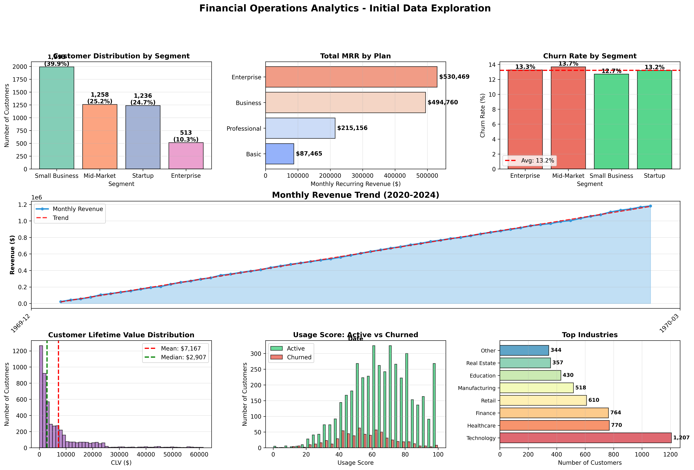

---

## 2. Time Series Decomposition

Revenue data decomposed into:

- Trend
- Seasonality
- Residual Components

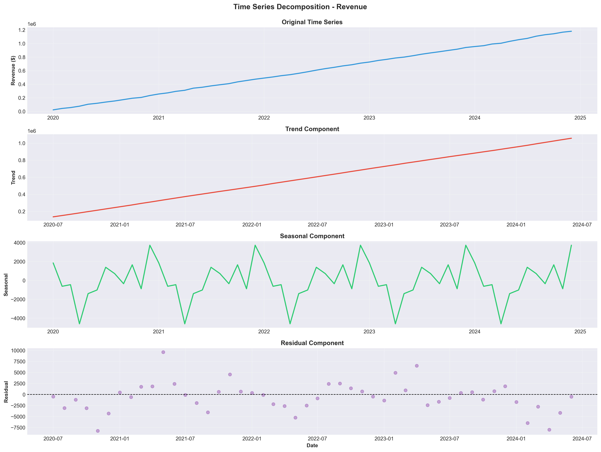

---

## 3. Autocorrelation Analysis (ACF / PACF)

Used for:

- ARIMA parameter selection
- Understanding seasonality
- Stationarity verification

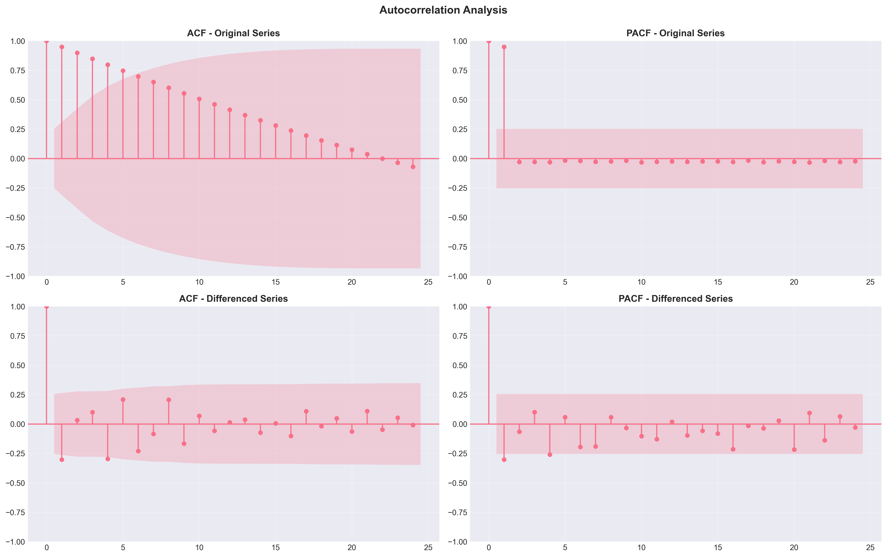

---

## 4. Revenue Forecast — ARIMA

Generated:

- Historical revenue
- Validation prediction
- Forecast horizon
- Confidence intervals

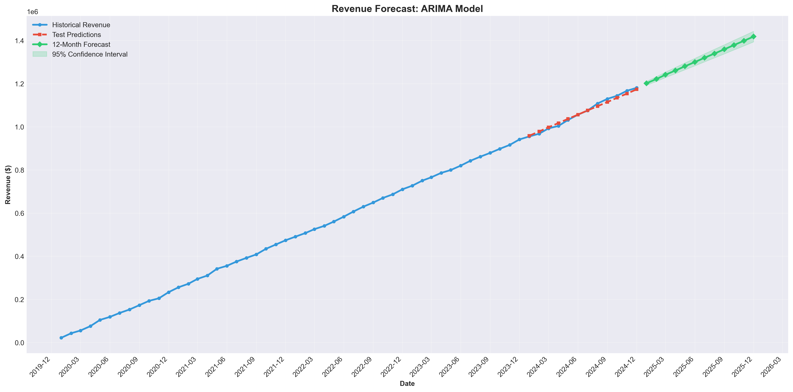

---

## 5. Revenue Forecast — Prophet

Generated future business projections using Prophet forecasting.

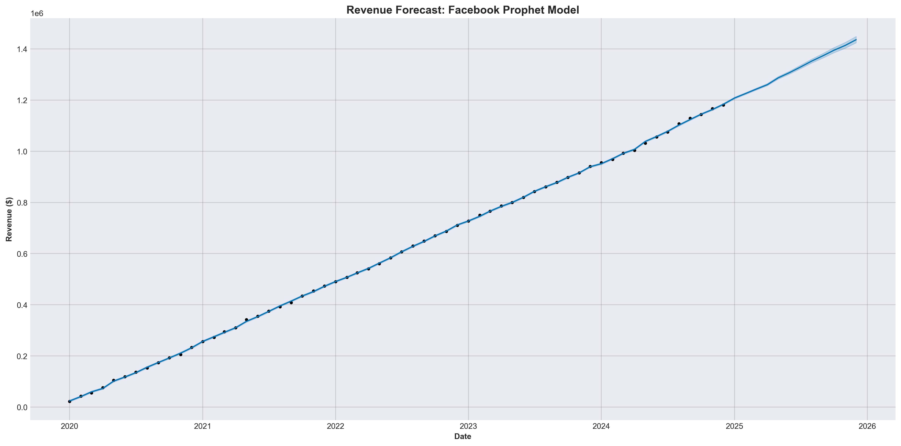

---

## 6. Prophet Components

Visualized:

- Long-term Trend
- Seasonality
- Forecast Components

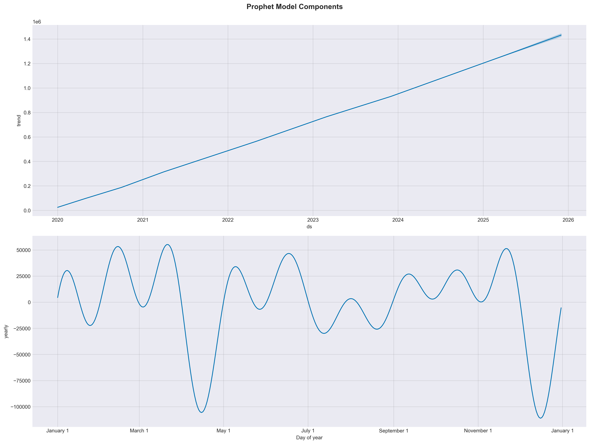

---

## 7. Customer Churn Analysis

Analyzed customer retention and potential churn patterns.

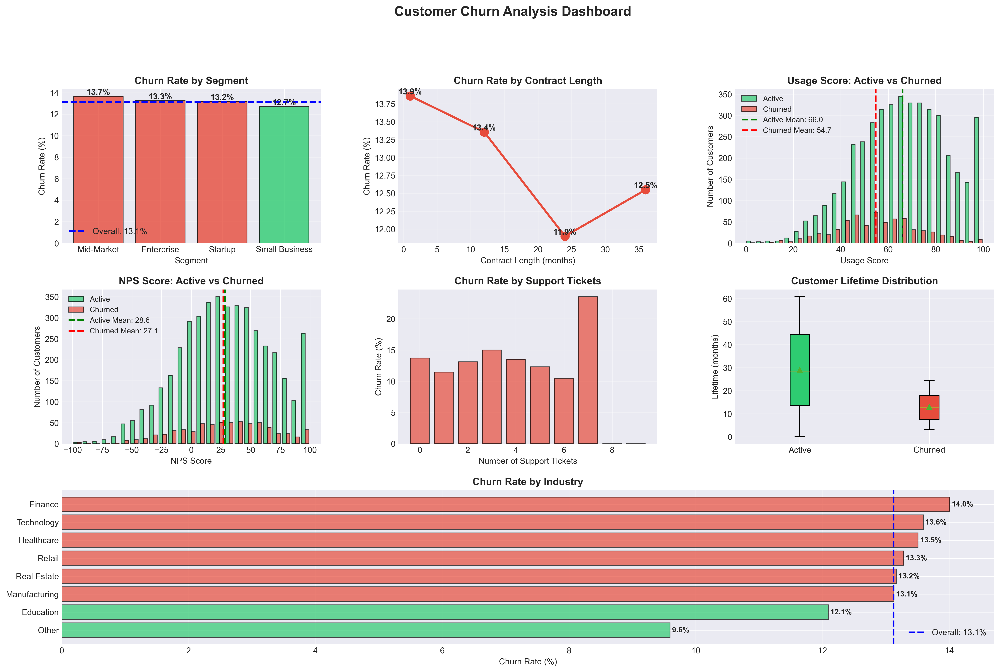

---

## 8. Churn Model Evaluation

Measured classification performance and prediction quality.

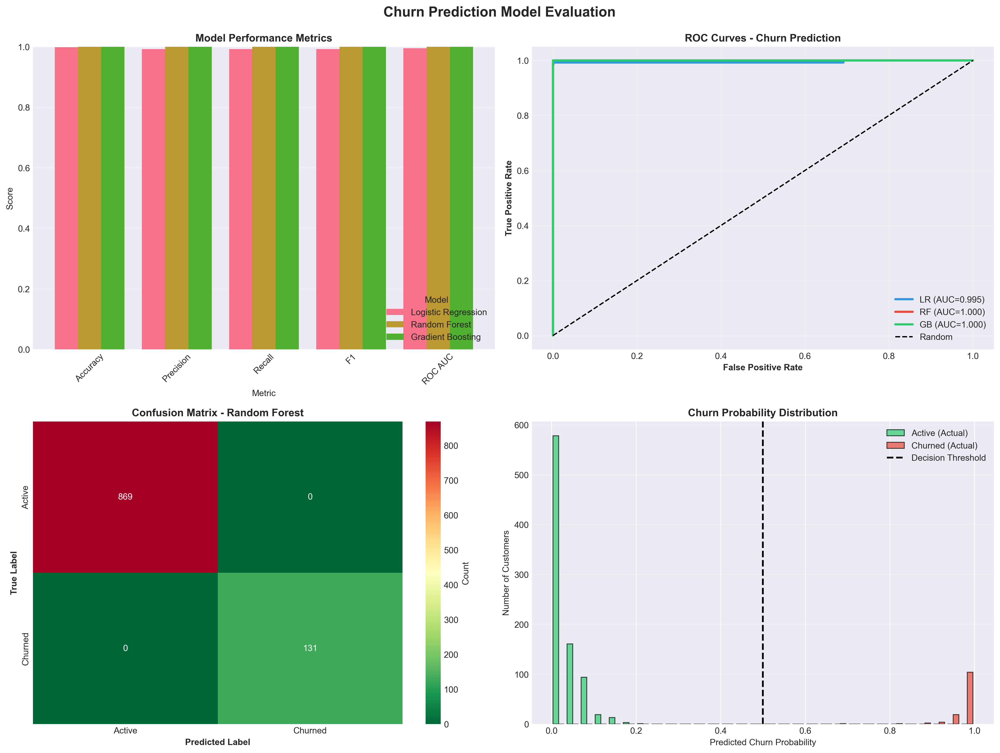

---

## 9. Feature Importance

Identified variables with strongest impact.

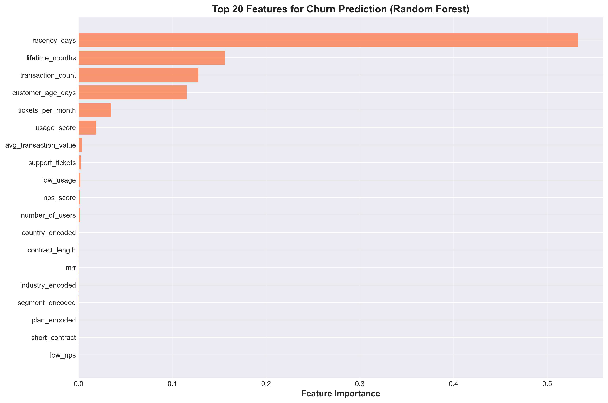

---

## 10. Risk Stratification

Segmented customers/business categories by risk level.

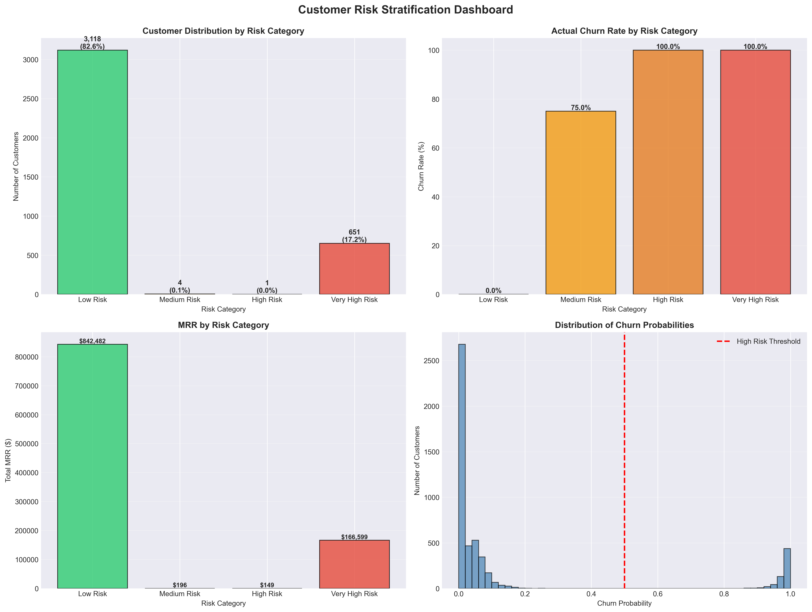

---

## 11. Cohort Retention Analysis

Measured customer retention across time windows.

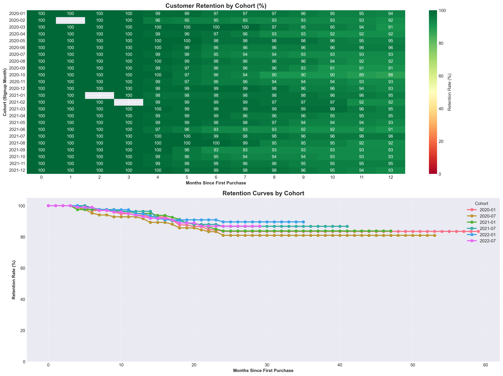

---

## 12. Revenue Cohorts

Compared revenue contribution across cohorts.

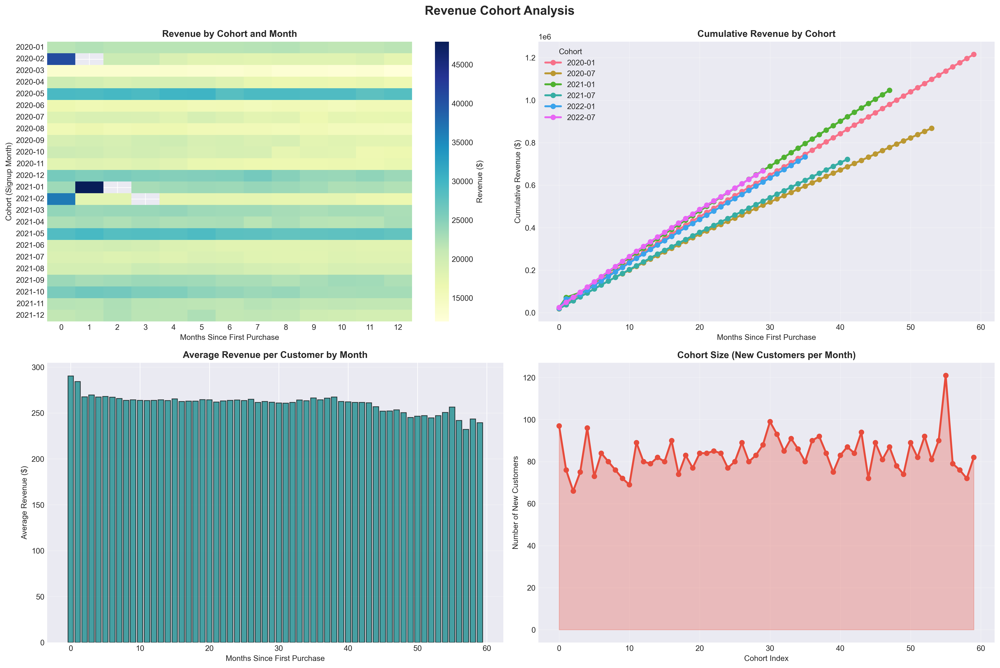

---

## 13. RFM Analysis

Customer segmentation using:

- Recency
- Frequency
- Monetary Value

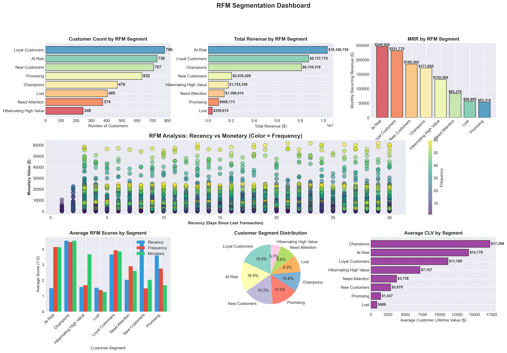

---

## 14. Customer Lifetime Value Analysis

Estimated long-term customer value.

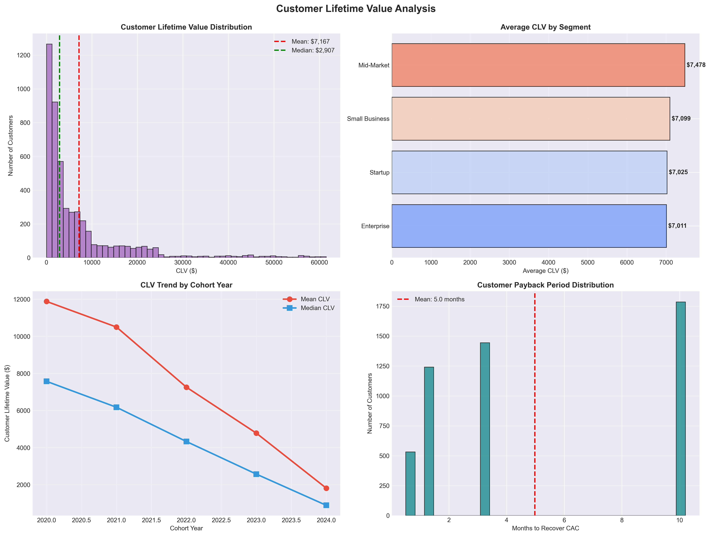

---

## 15. Profitability Dashboard

Final consolidated dashboard.

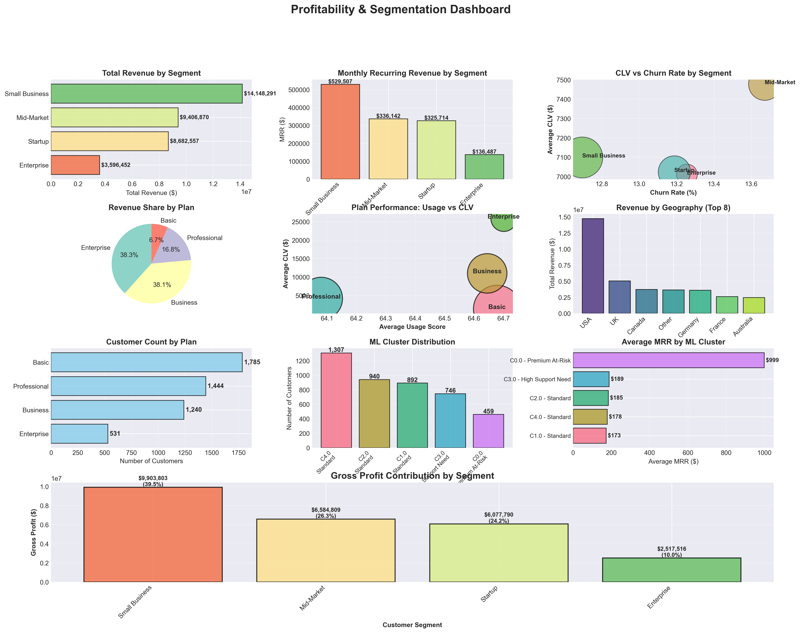

---

# 📈 Forecasting Methodology

## ARIMA

Parameters:

- p → Autoregressive
- d → Differencing
- q → Moving Average

Model selected using:

- AIC optimization
- Forecast evaluation

---

## Prophet

Used to:

- Capture seasonality
- Handle trend changes
- Improve interpretability

---

# 📋 Model Evaluation Metrics

Performance measured using:

- MAE
- RMSE
- MAPE

---

# ⚙️ Installation

Clone repository:

```bash
git clone https://github.com/dhruvkhator365/financial-operation-analytics.git
```

Move into directory:

```bash
cd financial-operation-analytics
```

Install packages:

```bash
pip install -r requirements.txt
```

Run:

```bash
jupyter notebook
```

Open:

```text
financial_operation_analytics.ipynb
```

---

# 📁 Repository Structure

financial-operation-analytics/

├── financial_operation_analytics.ipynb  
├── README.md  
├── requirements.txt  
├── financial_viz/  
└── .gitignore  

---

# 🔮 Future Improvements

- Streamlit Dashboard
- Interactive Forecasting
- Automated Reporting
- Real-Time Data Integration
- Cloud Deployment

---

# 👨‍💻 Author

Dhruv Khator  
B.Tech — Electrical & Electronics Engineering  
VNIT Nagpur

---
